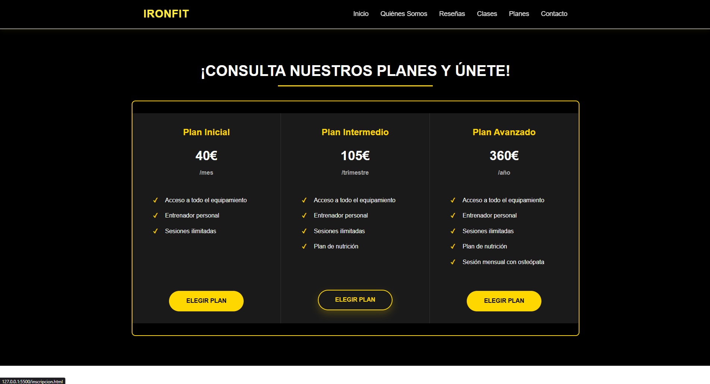

# 🏋️ IronFit - Landing Page de Gimnasio

**IronFit** es una landing page desarrollada como ejercicio de diseño web para un gimnasio ficticio. El objetivo principal es ofrecer una experiencia visual atractiva y funcional que represente los servicios, clases y planes disponibles en un gimnasio moderno.

El sitio está compuesto por una página principal con distintas secciones (Inicio, Reseñas, Clases, Planes, Contacto), y algunas páginas HTML adicionales para ampliar la información (por ejemplo, Inscripción, Clases y Quiénes Somos).

## 🌐 Características

- Diseño moderno y responsive
- Navegación fluida en una sola página (con algunas vistas externas)
- Información clara y bien estructurada
- Enlaces funcionales a contenidos detallados
- Formulario de contacto integrado
- Formulario de inscripción

## 📸 Vistas Previas

### Inicio


### Reseñas


### Planes


## 🛠️ Tecnologías Utilizadas

- HTML5  
- CSS3  
- JavaScript 

## 📁 Estructura del Proyecto

El proyecto está organizado en carpetas para separar estilos, scripts, imágenes y páginas auxiliares.

```
IronFit/
├── index.html
├── quienes-somos.html
├── clases.html
├── inscripcion.html
├── assets/
│   ├── css/
│   ├── favicon/
│   ├── js/
│   └── images/
```

## 📌 Nota

Este proyecto es ficticio y fue desarrollado con fines de práctica de maquetación web.
